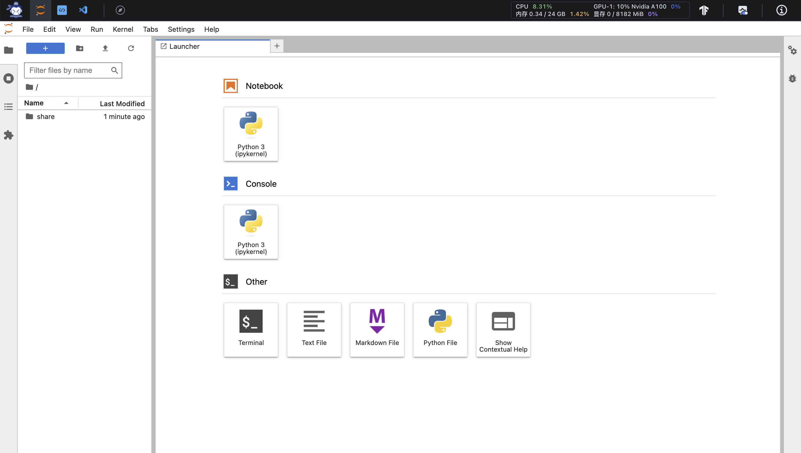
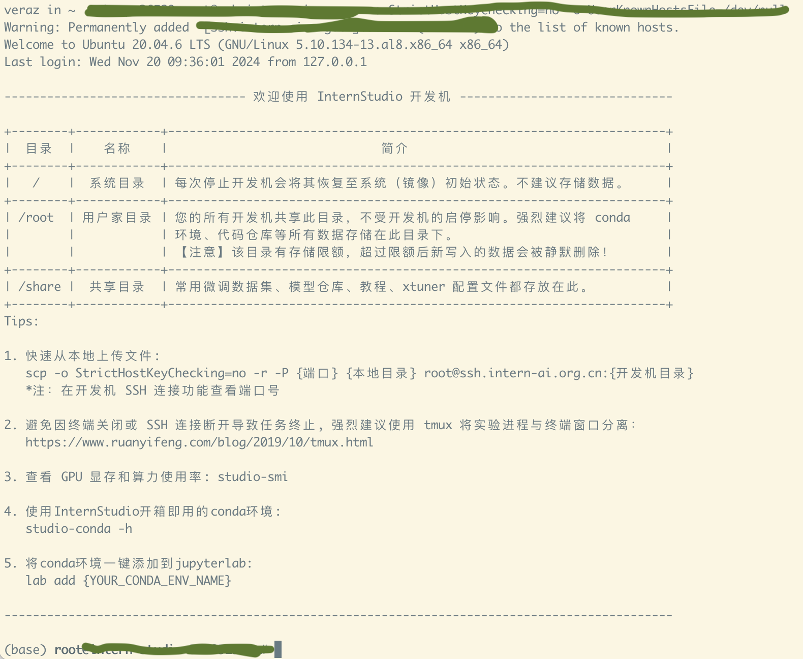
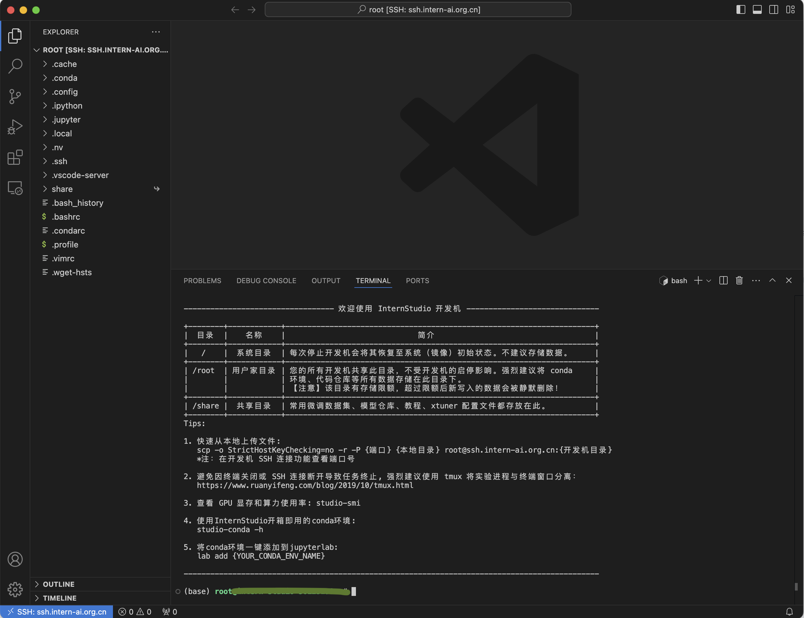
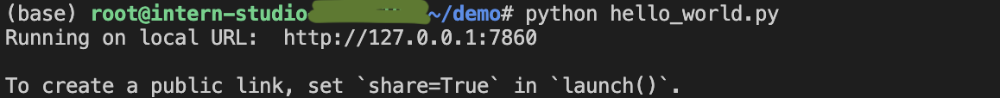

# 入门岛第 1 关：Linux 基础知识

[官方教程](https://github.com/InternLM/Tutorial/tree/camp4/docs/L0/linux)

## Step 0

登录[InternStudio](https://studio.intern-ai.org.cn/)

创建开发机后，直接进入该机器见到如下界面：


## Step 1

根据教程设置 ssh 远程链接，简单步骤如下：

1. 在开发机页面点击`ssh连接`获得连接端口和密码
2. 在本地电脑 terminal 中通过`ssh-keygen -t rsa`生成密钥对
3. 在 InternStudio 中配置 SSH Key（将后缀为.pub 的公钥上传）
4. 这时从本地 ssh 进机器就不再需要密码了

登录成功的界面


也可设置 VSCode 进行 ssh 远程链接，参看官方教程，配置成功后在 VSCode 中即可直接查看编辑文件以及进行命令行操作


## Step 2

端口映射（Port Mapping）是网络中的一种技术，通常用于将一个设备的本地网络端口映射到外部网络的端口，以便外部网络可以访问设备上的特定服务或应用程序。它通常用于路由器或防火墙配置中，使得来自外部网络的请求可以通过指定端口转发到内部网络的特定设备或端口上。

根据教程，首先在开发机中新建一个 demo 文件夹，然后添加一个文件`hello_world.py`，这个文件通过 gradio(注意要先 pip install gradio==4.29.0)通过端口 7860 展示一个网页。

这时，当运行`python hello_world.py`会在终端中得到如下显示：


该结果提示网页可通过开发机的端口 7860 访问。此时用浏览器访问http://127.0.0.1:7860时会无法显示相应网页，有两个原因：

1. 服务是跑在开发机上的，但是http://127.0.0.1访问的是本地网络
2. 开发机的 7860 端口不是外部网络可以访问的端口

这时就需要采用端口映射，即在本地浏览器中访问http://127.0.0.1:7860时，通过开发机暴露的端口将流量转发给开发机的内部端口。有两种方法：

1. 在本地终端上运行以下命令，`ssh -p {远程开发机暴露端口} root@ssh.intern-ai.org.cn -CNg -L {本地访问端口}:127.0.0.1:{远程开发机内部服务端口} -o StrictHostKeyChecking=no`，替换{远程开发机暴露端口}为开发机的开放端口，在 InternStudio 中可查，{本地访问端口}为本地机器的端口，{远程开发机内部服务端口}为运行网页服务时使用的开发机内部端口

```
例：
ssh -p 12345 root@ssh.intern-ai.org.cn -CNg -L 7780:127.0.0.1:7860 -o StrictHostKeyChecking=no
```

这个命令行的意思为通过 ssh 建立和远程开发机 ssh.intern-ai.org.cn 的端口映射，即当在本地浏览器中访问http://127.0.0.1:7780时，流量转发到ssh.intern-ai.org.cn的12345端口，然后开发机内容再将流量转发到其7860端口，该端口有网页服务，将会返回网页内容到浏览器中，这时就能在浏览器中看到如下网页：


2. 如果在 VSCode 中的终端中运行`python hello_world.py`端口会自动映射，不需要手动配置，可以修改映射端口。

## Step 3

常见 Linux 基础命令

```
touch: 创建空文件。
mkdir: 创建目录
cd: 目录切换
pwd: 显示所在目录
cat, more, less: 查看文件内容，如使用 cat 直接显示文件全部内容，more 和 less 可以分页查看。
vi, vim: 编辑文件
cp: 复制文件
ln: 创建文件链接
mv: 移动文件
rm: 删除文件
rmdir: 删除目录：rmdir（只能删除空目录）或 rm -r（可删除非空目录）
find: 查找文件
ls: 查看文件或目录的详细信息：使用 ls 命令，如使用 ls -l 查看目录下文件的详细信息。
sed: 处理文件，进行复杂的文件操作
ps：查看正在运行的进程
top：动态显示正在运行的进程
pstree：树状查看正在运行的进程
pgrep：用于查找进程
nice：更改进程的优先级
jobs：显示进程的相关信息
bg 和 fg：将进程调入后台
kill：杀死进程
nvidia-smi: 获取GPU摘要信息
tmux: 终端多路复用器，crtl+d退出tmux
conda: 开源的包管理和环境管理系统
```
