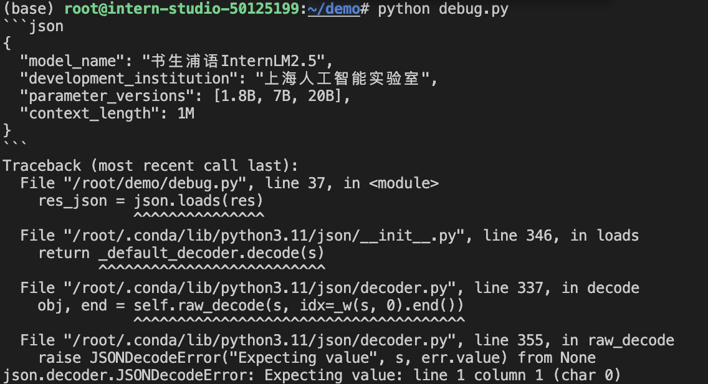
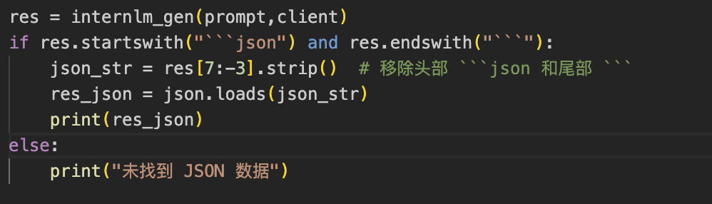

# 入门岛第 2 关：Python 基础知识

## Step 0

实现 Leetcode 383


## Step 1

VSCode 连接开发机，Debug 以下程序

```python
from openai import OpenAI
import json
def internlm_gen(prompt,client):
    '''
    LLM生成函数
    Param prompt: prompt string
    Param client: OpenAI client
    '''
    response = client.chat.completions.create(
        model="internlm2.5-latest",
        messages=[
            {"role": "user", "content": prompt},
      ],
        stream=False
    )
    return response.choices[0].message.content

api_key = ''
client = OpenAI(base_url="https://internlm-chat.intern-ai.org.cn/puyu/api/v1/",api_key=api_key)

content = """
书生浦语InternLM2.5是上海人工智能实验室于2024年7月推出的新一代大语言模型，提供1.8B、7B和20B三种参数版本，以适应不同需求。
该模型在复杂场景下的推理能力得到全面增强，支持1M超长上下文，能自主进行互联网搜索并整合信息。
"""
prompt = f"""
请帮我从以下``内的这段模型介绍文字中提取关于该模型的信息，要求包含模型名字、开发机构、提供参数版本、上下文长度四个内容，以json格式返回。
`{content}`
"""
res = internlm_gen(prompt,client)
res_json = json.loads(res)
print(res_json)
```

VSCode 远程连接好以后，在`demo`文件夹中新建一个`debug.py`文件，将以上有问题的代码复制粘贴进去，在 terminal 中运行`python debug.py`开始调试


由提示可知，环境缺乏 openai 这个库，那么通过 pip 安装一下


继续运行`python debug.py`得到以下提示


从命令行的 Traceback 提示无法连接上 API，那么检查代码可知 api_key 为空值，导致无法鉴权。由于直接使用明文是不好的编程规范，所以安装一下`python-dotenv`来设置 API_KEY 为环境变量。

将代码修改为


然后安装依赖，新添一个`.env`文件写入 API_KEY，再次运行看到新的错误


Traceback 提示无法对 res 进行 json 格式的读取，添加一行 print 函数，打印 res 出来看其内容是什么


运行程序输出：


可以看到`internlm_gen`函数返回的是 markdown 中的代码块格式，所以需要对该格式进行处理，提取出 json 部分的数据，修改代码如下


再次运行，程序调通：

