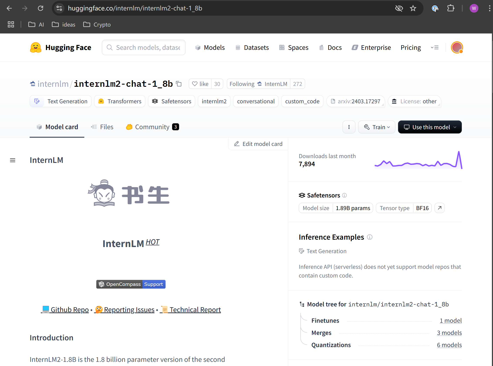
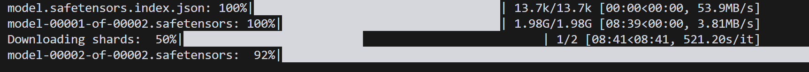
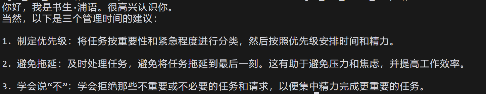

# 入门岛第 4 关：玩转 HF/魔搭/魔乐社区

## Hugging Face

下载以下模型


通过以下代码加载模型

```python
import torch
from transformers import AutoTokenizer, AutoModelForCausalLM
tokenizer = AutoTokenizer.from_pretrained("internlm/internlm2-chat-1_8b", trust_remote_code=True)
# `torch_dtype=torch.float16` 可以令模型以 float16 精度加载，否则 transformers 会将模型加载为 float32，导致显存不足
model = AutoModelForCausalLM.from_pretrained("internlm/internlm2-chat-1_8b", torch_dtype=torch.float16, trust_remote_code=True).cuda()
model = model.eval()
response, history = model.chat(tokenizer, "你好", history=[])
print(response)
# 你好！有什么我可以帮助你的吗？
response, history = model.chat(tokenizer, "请提供三个管理时间的建议。", history=history)
print(response)
```

运行该段代码前需要安装相关的依赖，本项目使用 pyenv 来管理 python 版本和 virtualenv

```python
pyenv install 3.12.5
pyenv virtualenv internlm
pyenv activate internlm
python -m pip install torch transformers sentencepiece protobuf einops
```

将前面代码写入`script.py`然后运行`python script.py`模型开始下载


下载结束后，代码会继续执行，得到以下输出


通过这个方法下载的模型存储在`~/.cache/huggingface`

也可以直接通过`huggingface_hub`下载

安装命令行

```shell
python -m pip install huggingface_hub
```

然后将`script.py`修改为

```python
from huggingface_hub import hf_hub_download

# 下载特定文件
repo_id = "internlm/internlm2-chat-1_8b"  # 模型库名
filename = "config.json"  # 模型库中的文件

# 下载文件到本地
file_path = hf_hub_download(repo_id=repo_id, filename=filename)

print(f"文件已下载到: {file_path}")
```
